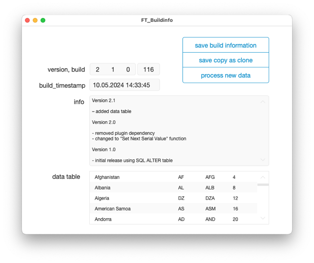

# FT Build Info
Dynamically transport information through a clone into the migrated solution.

## About This Project

When you deploy a new version of your solution, you cannot use normal fields to carry information such as version numbers, build numbers, or timestamps. These will be overwritten during data migration. Normally, a calculation field would do the trick; however, setting their values manually as part of your deployment pipeline or routine is not suitable for modern CI/CD scenarios.

## How Does It Work?

We use SQL to alter the default value of a field in a global table. Since the built-in ExecuteSQL() function only supports SELECT statements, we need a plugin for this purpose. You can store up to 255 characters as the field's default value.

After data migration, all fields contain the 'old' values from your previous production file. Upon opening the file, we perform a quick check of the field’s ModCount by querying the internal FileMaker_Fields table. As the ModCount changes every time you set new build information, a new version will be detected in the script, and the information will be extracted by creating a temporary new record. All this happens only once for every release. 
